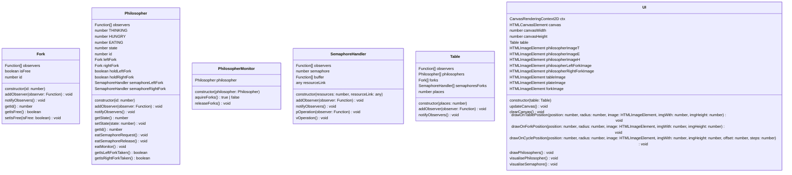

## UML

```mermaid
classDiagram
direction BT
class Fork {
constructor(id: number)
Function[] observers
boolean isFree
number id
addObserver(observer: Function) void
notifyObservers() void
getId() number
getIsFree() boolean
setIsFree(isFree: boolean) void
}
class Philosopher {
constructor(id: number)
Function[] observers
number THINKING
number HUNGRY
number EATING
number state
number id
Fork leftFork
Fork rightFork
boolean holdLeftFork
boolean holdRightFork
SemaphoreHandler semaphoreLeftFork
SemaphoreHandler semaphoreRightFork
addObserver(observer: Function) void
notifyObservers() void
getState() number
setState(state: number) void
getId() number
eatSemaphoreRequest() void
eatSemaphoreRelease() void
eatMonitor() void
getIsLeftForkTaken() boolean
getIsRightForkTaken() boolean
}
class PhilosopherMonitor {
constructor(philosopher: Philosopher)
Philosopher philosopher
aquireForks() true | false
releaseForks() void
}
class SemaphoreHandler {
constructor(resources: number, resourceLink: any)
Function[] observers
number semaphore
Function[] buffer
any resourceLink
addObserver(observer: Function) void
notifyObservers() void
pOperation(observer: Function) void
vOperation() void
}
class Table {
constructor(places: number)
Function[] observers
Philosopher[] philosophers
Fork[] forks
SemaphoreHandler[] semaphoresForks
number places
addObserver(observer: Function) void
notifyObservers() void
}
class UI {
constructor(table: Table)
CanvasRenderingContext2D ctx
HTMLCanvasElement canvas
number canvasWidth
number canvasHeight
Table table
HTMLImageElement philosopherImageT
HTMLImageElement philosopherImageE
HTMLImageElement philosopherImageH
HTMLImageElement philosopherLeftForkImage
HTMLImageElement philosopherRightForkImage
HTMLImageElement tableImage
HTMLImageElement plateImage
HTMLImageElement forkImage
updateCanvas() void
clearCanvas() void
drawOnTablePosition(position: number, radius: number, image: HTMLImageElement, imgWith: number, imgHeight: number) void
drawOnForkPosition(position: number, radius: number, image: HTMLImageElement, imgWith: number, imgHeight: number) void
drawOnCyclePosition(position: number, radius: number, image: HTMLImageElement, imgWith: number, imgHeight: number, offset: number, steps: number) void
drawPhilosophers() void
visualisePhilosopher() void
visualiseSemaphore() void
}
```
